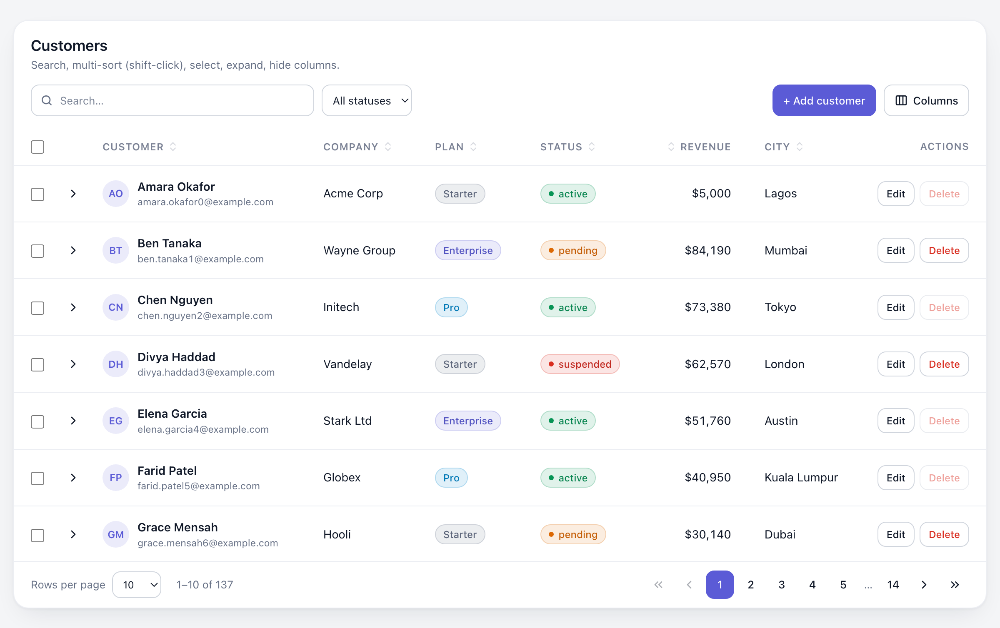
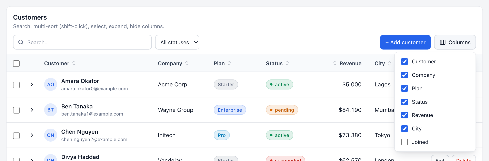
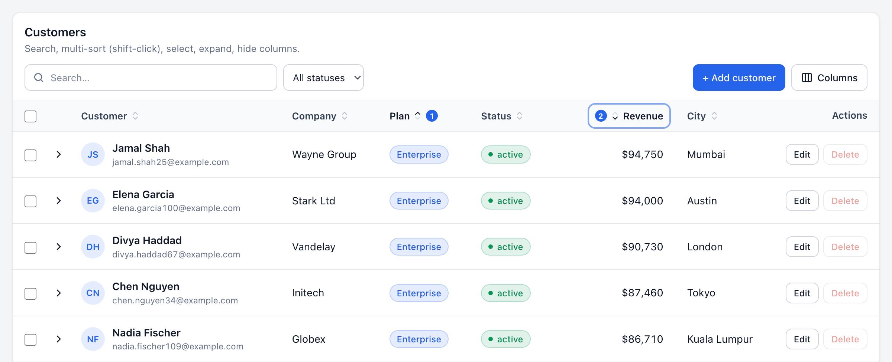
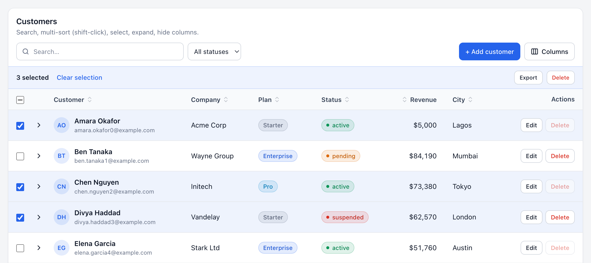
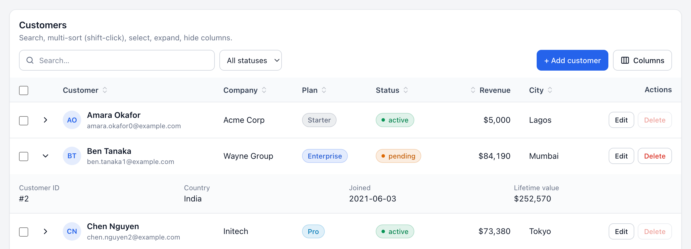
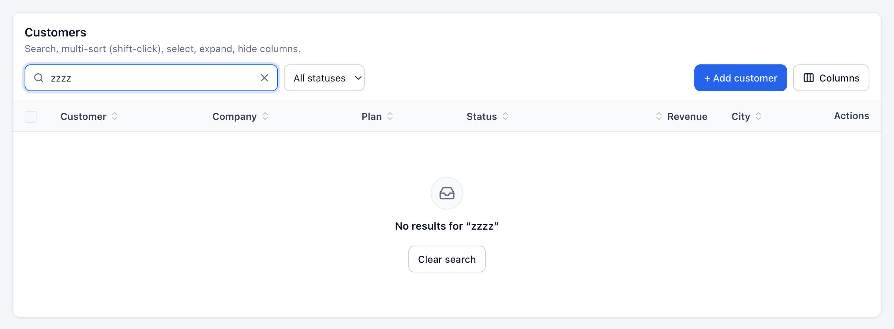
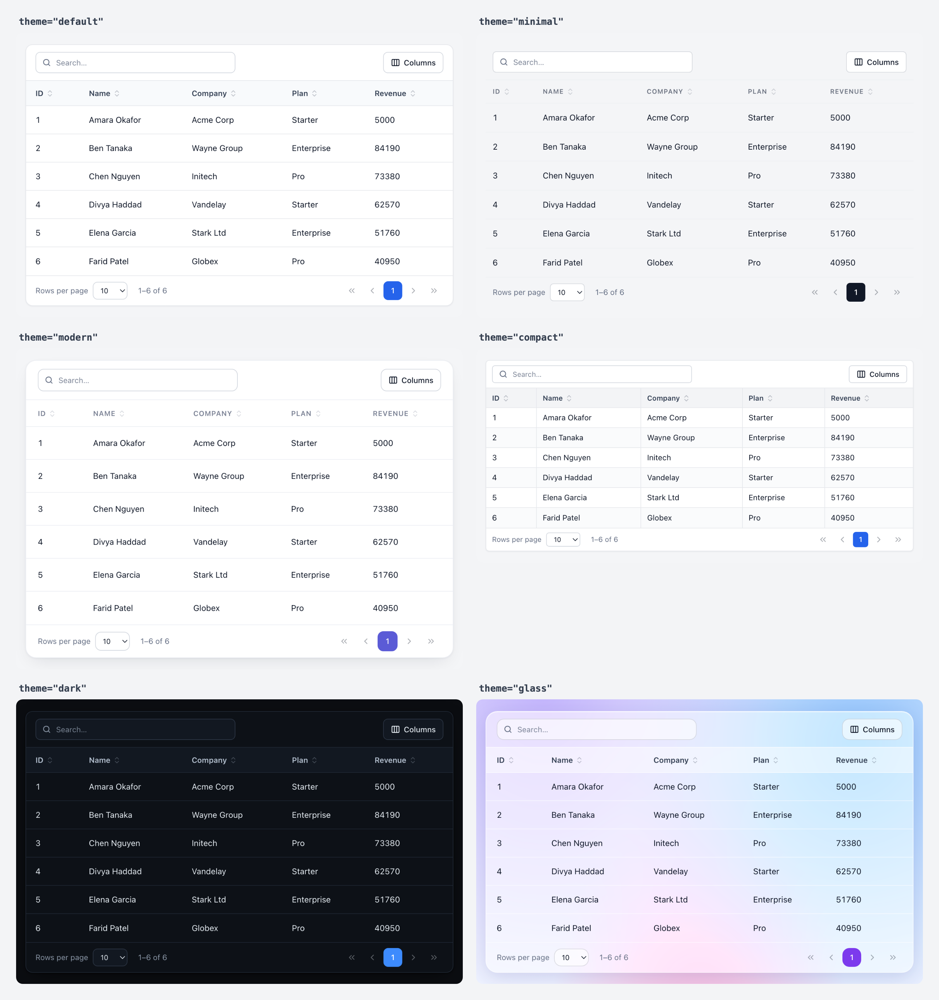
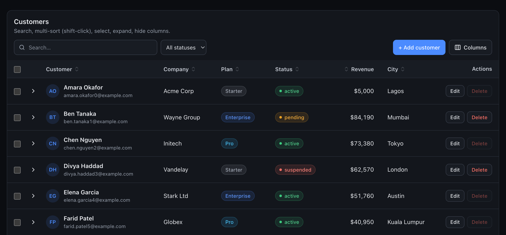
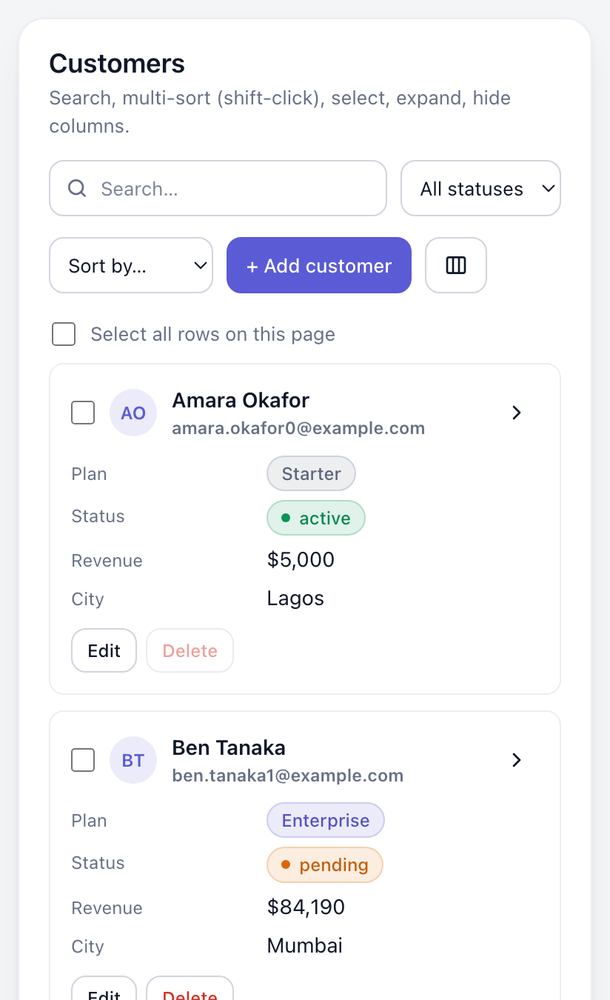

# @corinovate/react-data-table

**A beautiful, lightweight React data table for business apps.**
Simple by default. Powerful when needed.

[](https://www.npmjs.com/package/@corinovate/react-data-table)
[](https://bundlephobia.com/package/@corinovate/react-data-table)
[](./LICENSE)

<p>
  <a href="https://corinovate.github.io/react-data-table/"></a>
</p>



```tsx
<DataTable data={users} columns={columns} />
```

That one line gives you search, sorting, pagination, a column menu, loading/empty/error states, keyboard navigation and a polished, theme-able look.

- **Zero dependencies.** About 13 KB JS + 3 KB CSS (min + gzip).
- **6 built-in themes** (`default`, `minimal`, `modern`, `compact`, `dark`, `glass`) plus `createTheme()` for your brand.
- **Dark mode** for every theme: `light`, `dark` or follow the OS with `system`.
- **Responsive:** horizontal scroll, compact rows, or automatic **card view** on phones.
- **Business features:** multi-column sort, row selection with bulk actions, row actions, expandable rows, sticky header, status badges.
- **Server-side ready:** one `onQueryChange` callback for pagination, search and sorting.
- **Accessible:** semantic `<table>`, `aria-sort`, keyboard row navigation, screen-reader announcements.
- **TypeScript-first**, but plain JavaScript works the same.

Built for admin dashboards, CRMs, LMS and MLM platforms, property and resident management, reporting and customer management systems.

---

## Contents

1. [Installation](#installation)
2. [Quick start](#quick-start)
3. [Basic example](#basic-example)
4. [Column configuration](#column-configuration)
5. [Search](#search)
6. [Sorting](#sorting)
7. [Pagination](#pagination)
8. [Selection](#selection)
9. [Row actions](#row-actions)
10. [Custom cells](#custom-cells)
11. [Expandable rows](#expandable-rows)
12. [Loading, empty and error states](#loading-empty-and-error-states)
13. [Themes](#themes)
14. [Dark mode](#dark-mode)
15. [Responsive behavior](#responsive-behavior)
16. [Server-side data](#server-side-data)
17. [Customization](#customization)
18. [Accessibility](#accessibility)
19. [API reference](#api-reference)
20. [Examples](#examples)
21. [Troubleshooting](#troubleshooting)
22. [About](#about)

---

## Installation

```bash
npm install @corinovate/react-data-table
# or
yarn add @corinovate/react-data-table
# or
pnpm add @corinovate/react-data-table
```

Requires React 18 or newer. Import the stylesheet **once** in your app, for example in `main.tsx`, `_app.tsx` or `app/layout.tsx`:

```ts
import '@corinovate/react-data-table/styles.css';
```

## Quick start

```tsx
import { DataTable } from '@corinovate/react-data-table';
import '@corinovate/react-data-table/styles.css';

const users = [
  { id: 1, name: 'Amara Okafor', email: 'amara@example.com', role: 'Admin' },
  { id: 2, name: 'Ben Tanaka', email: 'ben@example.com', role: 'Member' },
];

export default function Users() {
  return <DataTable data={users} />;
}
```

With no `columns`, they are inferred from the first row (`firstName` becomes "First name").

## Basic example

```tsx
import { DataTable, renderBadge } from '@corinovate/react-data-table';

const columns = [
  { key: 'name', header: 'Name' },
  { key: 'email', header: 'Email' },
  {
    key: 'status',
    header: 'Status',
    render: renderBadge({ active: 'success', pending: 'warning', banned: 'danger' }),
  },
  {
    key: 'actions',
    header: 'Actions',
    render: (_, row) => (
      <button className="cdt-btn cdt-btn--sm" onClick={() => editUser(row)}>
        Edit
      </button>
    ),
  },
];

<DataTable title="Users" data={users} columns={columns} theme="modern" selectable />;
```

Columns that don't map to data (like `actions` above) are automatically excluded from sorting and search.

## Column configuration

```ts
interface Column<T> {
  key: string;            // property name or dot path: 'address.city'
  header?: ReactNode | (ctx) => ReactNode;  // default: humanized key
  label?: string;         // plain-text name for the column menu, card view and screen readers
  accessor?: (row) => any;                  // computed value
  render?: (value, row, ctx) => ReactNode;  // custom cell
  sortable?: boolean;     // default: true when the column has data
  compare?: (a, b) => number;               // custom sort
  searchable?: boolean;   // default: true when the column has data
  searchValue?: (row) => string;            // custom search text
  hidden?: boolean;       // start hidden (can be shown from the column menu)
  hideable?: boolean;     // appear in the column menu (default true)
  hideOnMobile?: boolean; // hide below the responsive breakpoint
  primary?: boolean;      // card title in card view (default: first column)
  align?: 'left' | 'center' | 'right';
  width?: number | string;
  minWidth?: number | string;
  className?: string | (row) => string;
  headerClassName?: string;
}
```

Computed and nested values:

```tsx
const columns = [
  { key: 'fullName', header: 'Name', accessor: (u) => `${u.firstName} ${u.lastName}` },
  { key: 'company.name', header: 'Company' },
  { key: 'revenue', align: 'right', render: (v) => `$${v.toLocaleString()}` },
];
```

Default cell formatting: empty values show a muted `—`, booleans show `Yes`/`No`, dates use `toLocaleDateString()`, arrays are joined with commas.

Users can show and hide columns from the built-in **Columns** menu. Columns with `hidden: true` start unchecked; `hideable: false` keeps a column out of the menu, and `columnToggle={false}` removes the menu entirely.



## Search

Search is on by default and matches every word across all searchable columns, case-insensitively (`"jane admin"` finds Jane in the Admin role).

```tsx
<DataTable data={users} searchPlaceholder="Search users…" />
<DataTable data={users} searchable={false} />

// Your own matching logic
<DataTable data={users} searchFn={(row, query) => row.email.startsWith(query)} />

// Controlled
const [search, setSearch] = useState('');
<DataTable data={users} search={search} onSearchChange={setSearch} />
```

`searchDebounce` (ms) delays filtering while typing. It defaults to `0` for client data and `300` with `serverSide`.

## Sorting

Click a header to sort ascending, again for descending, a third time to clear. **Shift-click** (or Shift+Enter) adds more columns for multi-column sorting; a small number shows each column's priority.



```tsx
<DataTable data={users} defaultSort={[{ key: 'createdAt', direction: 'desc' }]} />
<DataTable data={users} multiSort={false} />
<DataTable data={users} sortable={false} />

// Per column
{ key: 'priority', compare: (a, b) => rank[a.priority] - rank[b.priority] }
{ key: 'notes', sortable: false }

// Controlled
<DataTable data={users} sort={sort} onSortChange={setSort} />
```

Strings sort naturally (`item 9` before `item 10`), numbers and dates numerically, and empty values always go last.

## Pagination

Pagination is on by default with 10 rows per page.

```tsx
<DataTable data={users} defaultPageSize={25} pageSizeOptions={[25, 50, 100]} />
<DataTable data={users} pagination={false} />
<DataTable data={users} pageSizeOptions={[]} />  {/* hide the "rows per page" picker */}

// Controlled (page is 1-based)
<DataTable data={users} page={page} onPageChange={setPage} pageSize={size} onPageSizeChange={setSize} />
```

**Custom pagination:**

```tsx
<DataTable
  data={users}
  renderPagination={({ page, pageCount, canNextPage, setPage, from, to, totalRows }) => (
    <div>
      Showing {from}–{to} of {totalRows}
      <button disabled={!canNextPage} onClick={() => setPage(page + 1)}>Load more</button>
    </div>
  )}
/>
```

The built-in `<Pagination>` component is also exported if you want to place it elsewhere.

## Selection

```tsx
<DataTable
  data={users}
  selectable                      // or "single"
  onSelectionChange={(keys, rows) => console.log(keys, rows)}
  isRowSelectable={(row) => row.role !== 'Owner'}
  bulkActions={(rows, { clearSelection }) => (
    <>
      <button className="cdt-btn cdt-btn--sm" onClick={() => exportCsv(rows)}>Export</button>
      <button
        className="cdt-btn cdt-btn--sm cdt-btn--danger"
        onClick={async () => { await deleteUsers(rows); clearSelection(); }}
      >
        Delete {rows.length}
      </button>
    </>
  )}
/>
```



- The header checkbox selects the current page. A **"Select all N"** link then selects every matching row (client-side data).
- A bar with the selected count, **Clear selection** and your `bulkActions` appears while rows are selected.
- Selection is stored by row key, so it survives sorting, paging and refetching. Rows get keys from `rowKey` (a property name or function), falling back to `row.id`, then the index.
- Controlled: `selectedKeys` + `onSelectionChange`.

## Row actions

The fastest way is the `rowActions` prop, which adds a right-aligned **Actions** column:

```tsx
<DataTable
  data={users}
  rowActions={[
    { label: 'Edit', onClick: (row) => openEditor(row) },
    { label: 'Delete', variant: 'danger', onClick: (row) => remove(row), disabled: (row) => row.isOwner },
    { label: 'Impersonate', icon: <UserIcon />, iconOnly: true, hidden: (row) => !isAdmin, onClick: impersonate },
  ]}
/>
```

Variants: `default`, `primary`, `danger`, `ghost`. For full control, pass a function: `rowActions={(row) => <MyMenu row={row} />}`, or use a regular column with `render` as in the [basic example](#basic-example).

Clicks on buttons, links and inputs inside a row never trigger `onRowClick`.

## Custom cells

`render(value, row, ctx)` receives the cell value, the whole row and `{ rowKey, rowIndex, column }`.

```tsx
import { Badge } from '@corinovate/react-data-table';

const columns = [
  {
    key: 'name',
    render: (_, user) => (
      <div style={{ display: 'flex', gap: 8, alignItems: 'center' }}>
        
        <div>
          <strong>{user.name}</strong>
          <div style={{ color: 'var(--cdt-text-muted)' }}>{user.email}</div>
        </div>
      </div>
    ),
    searchValue: (user) => `${user.name} ${user.email}`,
  },
  { key: 'plan', render: (plan) => <Badge tone={plan === 'Pro' ? 'accent' : 'neutral'}>{plan}</Badge> },
];
```

**Badges** follow the active theme. Tones: `neutral`, `accent`, `success`, `warning`, `danger`, `info`. `renderBadge(map, { dot, fallback, format })` builds a status column renderer in one line.

**Custom headers:** `header` accepts a node or a function of `{ column, sortDirection, sortIndex }`:

```tsx
{ key: 'revenue', header: () => <span title="Last 12 months">Revenue (12m)</span> }
```

## Expandable rows

```tsx
<DataTable
  data={orders}
  renderExpanded={(order) => <OrderLines items={order.items} />}
  isRowExpandable={(order) => order.items.length > 0}
/>
```



Rows can also be expanded from the keyboard with Enter or the right arrow. Controlled: `expandedKeys` + `onExpandedChange`.

## Loading, empty and error states

```tsx
<DataTable
  data={users}
  loading={isLoading}           // skeleton rows on first load; progress bar while reloading
  error={error}                 // Error, string, or true
  onRetry={refetch}             // shows a "Try again" button
  emptyState={<EmptyUsers onInvite={invite} />}
  loadingState={<Spinner />}    // replaces the skeleton
  errorState={(err) => <MyError error={err} />}
/>
```

When a search has no results, the table shows "No results for …" with a **Clear search** button.



## Themes

```tsx
<DataTable data={users} theme="modern" />
```

| Theme     | Looks like                                                          |
| --------- | ------------------------------------------------------------------- |
| `default` | Clean, neutral business look that fits anywhere                     |
| `minimal` | No card, airy rows, small uppercase headers, monochrome accent      |
| `modern`  | Large radius, soft shadow, generous spacing, indigo accent          |
| `compact` | Dense spreadsheet-like rows with grid lines, for reports            |
| `dark`    | A dedicated deep-navy dark theme (always dark)                      |
| `glass`   | Frosted translucent surfaces; best on colorful or image backgrounds |



Themes control more than colors: border radius, spacing, row height, typography, header style, borders, hover and stripe colors, shadows, buttons, badges, pagination and overall density. They are design tokens applied as CSS variables.

### Create your own theme

```tsx
import { createTheme } from '@corinovate/react-data-table';

const brand = createTheme({
  extends: 'modern',              // start from any preset
  name: 'acme',
  tokens: {
    accent: '#0f766e',
    radius: '10px',
    fontFamily: '"Inter", sans-serif',
    headerTextTransform: 'none',
  },
  darkTokens: { accent: '#2dd4bf', accentText: '#042f2e' },
});

<DataTable data={users} theme={brand} colorMode="system" />;
```

<details>
<summary><strong>All theme tokens</strong></summary>

| Group      | Tokens |
| ---------- | ------ |
| Colors     | `background`, `headerBackground`, `rowHoverBackground`, `rowStripeBackground`, `rowSelectedBackground`, `expandedBackground`, `controlBackground`, `popoverBackground`, `border`, `borderStrong`, `text`, `textMuted`, `headerText`, `accent`, `accentText`, `success`, `warning`, `danger`, `info`, `focusRing`, `skeleton` |
| Shape      | `radius`, `controlRadius`, `badgeRadius`, `borderWidth`, `rowBorderWidth`, `columnBorderWidth`, `shadow`, `popoverShadow`, `backdropFilter` |
| Density    | `cellPaddingX`, `cellPaddingY`, `headerPaddingY`, `rowHeight`, `controlHeight`, `gap` |
| Typography | `fontFamily`, `fontSize`, `lineHeight`, `headerFontSize`, `headerFontWeight`, `headerTextTransform`, `headerLetterSpacing`, `titleFontSize` |
| Motion     | `transition` |

Each token becomes a CSS variable: `rowHoverBackground` → `--cdt-row-hover-background`.

</details>

### Plain CSS works too

Every token is a CSS variable, so you can override them from your stylesheet. The root element also exposes `data-cdt-theme` and `data-cdt-mode` attributes.

```css
.my-table {
  --cdt-accent: #e11d48 !important;
}
.cdt[data-cdt-mode='dark'] {
  --cdt-border: #333 !important;
}
```

(`!important` is needed because theme variables are set inline. Prefer `createTheme` when you can.)

## Dark mode

Every theme has a dark variant.

```tsx
<DataTable data={users} colorMode="dark" />
<DataTable data={users} colorMode="system" />            {/* follows the OS, live */}
<DataTable data={users} colorMode={isDark ? 'dark' : 'light'} />  {/* your app's toggle */}
```

`colorMode` defaults to `light`. The `dark` theme is always dark regardless of `colorMode`.



## Responsive behavior

The table responds to **its own width** (not the viewport), so it behaves correctly inside sidebars, modals and grid layouts.

```tsx
<DataTable data={users} responsive="cards" breakpoint={640} />
```

| `responsive`       | Below the breakpoint                                                      |
| ------------------ | ------------------------------------------------------------------------- |
| `scroll` (default) | Full table that scrolls horizontally                                      |
| `compact`          | Tighter rows and padding, still scrollable                                |
| `cards`            | Each row becomes a card with label/value pairs; a "Sort by" menu appears  |

In every mode, columns with `hideOnMobile: true` are hidden below the breakpoint, and pagination switches to a compact "Page X of Y" layout. In card view, the column with `primary: true` (or the first column) becomes the card title.

<p align="center">
  
</p>

**Sticky header:** `stickyHeader` keeps the header visible while the body scrolls inside `maxHeight` (default `70vh`).

```tsx
<DataTable data={logs} stickyHeader maxHeight={480} />
```

## Server-side data

Add `serverSide`, give it the current page of data and the total, and fetch whenever `onQueryChange` fires. It fires on mount and whenever the page, page size, search (debounced) or sort changes, and the page resets to 1 when search or sort change.

```tsx
import { useEffect, useState } from 'react';
import { DataTable, type TableQuery } from '@corinovate/react-data-table';

function Customers() {
  const [query, setQuery] = useState<TableQuery | null>(null);
  const [result, setResult] = useState({ rows: [], total: 0 });
  const [loading, setLoading] = useState(true);
  const [error, setError] = useState<Error | null>(null);

  useEffect(() => {
    if (!query) return;
    const params = new URLSearchParams({
      page: String(query.page),
      limit: String(query.pageSize),
      q: query.search,
      sort: query.sort.map((s) => `${s.key}:${s.direction}`).join(','),
    });
    setLoading(true);
    fetch(`/api/customers?${params}`)
      .then((r) => r.json())
      .then((json) => { setResult({ rows: json.data, total: json.total }); setError(null); })
      .catch(setError)
      .finally(() => setLoading(false));
  }, [query]);

  return (
    <DataTable
      serverSide
      data={result.rows}
      totalRows={result.total}
      loading={loading}
      error={error}
      onQueryChange={setQuery}
      columns={columns}
    />
  );
}
```

With React Query / SWR, use the query as part of the key:

```tsx
const [query, setQuery] = useState<TableQuery>({ page: 1, pageSize: 10, search: '', sort: [] });
const { data, isFetching, error } = useQuery({ queryKey: ['customers', query], queryFn: () => api.list(query), placeholderData: keepPreviousData });

<DataTable serverSide data={data?.rows ?? []} totalRows={data?.total} loading={isFetching} error={error} onQueryChange={setQuery} />
```

While loading, existing rows stay visible (dimmed, with a progress bar) so the layout doesn't jump.

**Filters:** render your own filter controls through `filters` and include them in your fetch. To return to page 1 when a filter changes, control the page:

```tsx
<DataTable
  serverSide
  page={page}
  onPageChange={setPage}
  filters={<StatusSelect value={status} onChange={(s) => { setStatus(s); setPage(1); }} />}
  ...
/>
```

## Customization

| What               | How |
| ------------------ | --- |
| Cells              | `column.render`, `column.className`, `column.align` |
| Headers            | `column.header` (node or function), `column.headerClassName` |
| Rows               | `rowClassName`, `onRowClick` |
| Actions            | `rowActions` (array or function), `bulkActions` |
| Toolbar            | `title`, `description`, `filters`, `toolbarActions`, `columnToggle`, `searchable` |
| Empty / loading / error | `emptyState`, `loadingState`, `errorState` |
| Pagination         | `renderPagination`, `pageSizeOptions`, or the exported `<Pagination>` |
| Theme              | `theme`, `createTheme`, CSS variables |
| Text / i18n        | `labels` |
| CSS classes        | `className`, `classNames`, `style` |

**Class names for each part:**

```tsx
<DataTable
  classNames={{ root: 'shadow-xl', toolbar: 'px-6', th: 'uppercase', tr: 'group', td: 'py-4', pagination: 'gap-2' }}
/>
```

Slots: `root`, `header`, `toolbar`, `search`, `bulkBar`, `container`, `table`, `thead`, `th`, `tbody`, `tr`, `td`, `card`, `footer`, `pagination`.

**Built-in button styles** can be reused in your own cells and toolbar: `cdt-btn`, plus modifiers `cdt-btn--primary`, `cdt-btn--danger`, `cdt-btn--ghost`, `cdt-btn--sm`, `cdt-btn--icon`. `cdt-select` and `cdt-input` style form controls.

**Translations:**

```tsx
<DataTable
  labels={{
    searchPlaceholder: 'Buscar…',
    rowsPerPage: 'Filas por página',
    empty: 'Sin datos',
    rangeInfo: (from, to, total) => `${from}–${to} de ${total}`,
    selectedCount: (n) => `${n} seleccionados`,
  }}
/>
```

See `defaultLabels` for the full list.

**Headless use:** `useDataTable(options)` exposes the same engine (rows, sorting, pagination, selection, expansion) for a completely custom UI.

```tsx
const table = useDataTable({ data, columns });
table.rows.map(({ row, key }) => …);
table.toggleSort('name'); table.setPage(2); table.toggleRowSelection(key);
```

## Accessibility

- Semantic `<table>`, `<thead>`, `<th scope="col">`, with `aria-sort` on sorted columns. Sort controls are real `<button>`s.
- The table's accessible name comes from `title`, `ariaLabel` or `caption`.
- **Keyboard:** Tab reaches every control. When rows are interactive (selectable, clickable or expandable), Tab enters the rows once and then:
  - <kbd>↑</kbd> <kbd>↓</kbd> <kbd>Home</kbd> <kbd>End</kbd> move between rows
  - <kbd>Space</kbd> selects the row
  - <kbd>Enter</kbd> runs `onRowClick` (or toggles expansion)
  - <kbd>→</kbd> / <kbd>←</kbd> expand / collapse
  - <kbd>Shift</kbd>+<kbd>Enter</kbd> on a header adds it to a multi-column sort
- Sort changes, search result counts and loading are announced through a polite live region.
- Checkboxes, expand toggles, icon-only actions and pagination buttons all have labels; the current page uses `aria-current`.
- Visible `:focus-visible` rings use the theme accent; animations respect `prefers-reduced-motion`.
- Paginated tables set `aria-rowcount`/`aria-rowindex`, so screen readers announce "row 12 of 58".

## API reference

### `<DataTable>` props

**Data**

| Prop | Type | Default | Description |
| --- | --- | --- | --- |
| `data` | `T[]` | `[]` | Rows to display |
| `columns` | `Column<T>[]` | inferred | Column definitions |
| `rowKey` | `string \| (row, index) => string \| number` | `row.id` → index | Stable row identity |

**Search**

| Prop | Type | Default |
| --- | --- | --- |
| `searchable` | `boolean` | `true` |
| `search` / `defaultSearch` / `onSearchChange` | `string` / `string` / `(s) => void` | |
| `searchPlaceholder` | `string` | `"Search…"` |
| `searchDebounce` | `number` (ms) | `0` (client), `300` (server) |
| `searchFn` | `(row, query) => boolean` | |

**Sorting**

| Prop | Type | Default |
| --- | --- | --- |
| `sortable` | `boolean` | `true` |
| `multiSort` | `boolean` | `true` |
| `sort` / `defaultSort` / `onSortChange` | `SortItem[]` | `[]` |

**Pagination**

| Prop | Type | Default |
| --- | --- | --- |
| `pagination` | `boolean` | `true` |
| `page` / `defaultPage` / `onPageChange` | `number` (1-based) | `1` |
| `pageSize` / `defaultPageSize` / `onPageSizeChange` | `number` | `10` |
| `pageSizeOptions` | `number[]` | `[10, 25, 50, 100]` |
| `renderPagination` | `(props: PaginationRenderProps) => ReactNode` | |

**Selection & rows**

| Prop | Type | Default |
| --- | --- | --- |
| `selectable` | `boolean \| 'single' \| 'multiple'` | `false` |
| `selectedKeys` / `defaultSelectedKeys` / `onSelectionChange` | `RowKey[]` / … / `(keys, rows) => void` | |
| `isRowSelectable` | `(row) => boolean` | |
| `bulkActions` | `(rows, { selectedKeys, clearSelection }) => ReactNode` | |
| `rowActions` | `RowAction<T>[] \| (row) => ReactNode` | |
| `onRowClick` | `(row, event) => void` | |
| `rowClassName` | `string \| (row, index) => string` | |
| `renderExpanded` | `(row) => ReactNode` | |
| `isRowExpandable` | `(row) => boolean` | |
| `expandedKeys` / `defaultExpandedKeys` / `onExpandedChange` | `RowKey[]` | |

**Columns**

| Prop | Type | Default |
| --- | --- | --- |
| `columnToggle` | `boolean` | `true` |
| `hiddenColumns` / `defaultHiddenColumns` / `onHiddenColumnsChange` | `string[]` | from `column.hidden` |

**Server-side**

| Prop | Type | Description |
| --- | --- | --- |
| `serverSide` | `boolean` | Don't search/sort/paginate locally |
| `totalRows` | `number` | Total rows on the server |
| `onQueryChange` | `(query: TableQuery) => void` | `{ page, pageSize, search, sort }`; fires on mount and on change |

**States**

| Prop | Type |
| --- | --- |
| `loading` | `boolean` |
| `error` | `unknown` (Error, string, `true`) |
| `onRetry` | `() => void` |
| `loadingState` / `emptyState` | `ReactNode` |
| `errorState` | `ReactNode \| (error) => ReactNode` |

**Appearance & layout**

| Prop | Type | Default |
| --- | --- | --- |
| `theme` | `ThemeName \| Theme` | `'default'` |
| `colorMode` | `'light' \| 'dark' \| 'system'` | `'light'` |
| `responsive` | `'scroll' \| 'cards' \| 'compact'` | `'scroll'` |
| `breakpoint` | `number` (px) | `640` |
| `stickyHeader` | `boolean` | `false` |
| `maxHeight` | `number \| string` | `'70vh'` |
| `title` / `description` | `ReactNode` | |
| `filters` / `toolbarActions` | `ReactNode` | |
| `className` / `classNames` / `style` | | |
| `ariaLabel` / `caption` | `string` / `ReactNode` | |
| `labels` | `Partial<DataTableLabels>` | |

### Other exports

| Export | Description |
| --- | --- |
| `useDataTable(options)` | Headless engine behind `<DataTable>` |
| `createTheme(options)` | Build a theme from a preset + token overrides |
| `themes` | The built-in theme objects |
| `resolveTheme(theme, mode)` | Get the full token set / CSS variables for a theme |
| `Badge`, `renderBadge` | Theme-aware status badges |
| `Pagination` | The built-in pagination bar |
| `defaultLabels` | All UI strings |
| `sortRows`, `searchRows`, `getValue` | The pure helpers used internally |

Types: `Column`, `DataTableProps`, `RowAction`, `SortItem`, `TableQuery`, `Theme`, `ThemeTokens`, `RowKey`, `PaginationRenderProps`, and more.

## Examples

**CRM contacts with a filter and an "Add" button**

```tsx
<DataTable
  title="Contacts"
  data={contacts.filter((c) => stage === 'all' || c.stage === stage)}
  columns={columns}
  theme="modern"
  responsive="cards"
  filters={
    <select className="cdt-select" value={stage} onChange={(e) => setStage(e.target.value)} aria-label="Stage">
      <option value="all">All stages</option>
      <option value="lead">Lead</option>
      <option value="customer">Customer</option>
    </select>
  }
  toolbarActions={<button className="cdt-btn cdt-btn--primary" onClick={openNew}>+ New contact</button>}
  rowActions={[{ label: 'Open', onClick: (c) => navigate(`/contacts/${c.id}`) }]}
/>
```

**Dense financial report**

```tsx
<DataTable
  data={transactions}
  theme="compact"
  stickyHeader
  maxHeight={600}
  defaultPageSize={50}
  defaultSort={[{ key: 'date', direction: 'desc' }]}
  columns={[
    { key: 'date', width: 110 },
    { key: 'reference' },
    { key: 'member.name', header: 'Member' },
    { key: 'amount', align: 'right', render: (v) => currency.format(v) },
  ]}
/>
```

**Network-marketing downline with expandable rows**

```tsx
<DataTable
  data={distributors}
  columns={[
    { key: 'name' },
    { key: 'rank', render: renderBadge({ Diamond: 'accent', Gold: 'warning', Silver: 'neutral' }) },
    { key: 'personalVolume', header: 'PV', align: 'right' },
    { key: 'groupVolume', header: 'GV', align: 'right' },
  ]}
  renderExpanded={(d) => <CommissionBreakdown distributor={d} />}
/>
```

**Try it live:** the [online demo](https://corinovate.github.io/react-data-table/) shows every theme, dark mode, card view and a simulated server. To run the same playground locally, clone the repo, then `npm install` and `npm run dev`.

## Troubleshooting

**The table has no styles.**
Import `@corinovate/react-data-table/styles.css` once in your app.

**Selections get mixed up after sorting or on the next page.**
Rows need stable keys. Add an `id` field or pass `rowKey="uuid"` / `rowKey={(row) => row.email}`.

**My actions column has a sort button.**
A column is sortable when its key has data in the rows. Add `sortable: false` (and `searchable: false`) if your rows happen to contain that key.

**Next.js: "useState only works in Client Components".**
The package ships with `"use client"`, so you can render `<DataTable>` from a Server Component. Functions you pass (like `render`) must live in a Client Component file, because functions can't cross the server/client boundary.

**The sticky header doesn't stick.**
The header sticks inside the table's own scroll area. Make sure `stickyHeader` is set and adjust `maxHeight`.

**Clicking a button inside a cell also triggers `onRowClick`.**
Buttons, links, inputs and labels are ignored automatically. For other custom elements, add the `data-cdt-no-row-click` attribute.

**The card view never appears.**
Card view depends on the table's own width, not the screen's. Check that the container is narrower than `breakpoint` (default 640px) and that `responsive="cards"` is set.

**Server-side: the table fetches twice in development.**
React StrictMode runs effects twice in development. Duplicate identical queries are suppressed, but if your fetch runs in your own effect, cancel stale requests (see the server-side example).

**Glass theme looks flat.**
Glass is translucent; it needs a colorful or image background behind it to show the frosted effect.

## Contributing

```bash
npm install
npm run dev        # playground at http://localhost:5173
npm test           # unit + component tests
npm run typecheck
npm run build
```

See [ARCHITECTURE.md](./ARCHITECTURE.md) for how the code is organized.

## About

Built and maintained by **[Corinovate](https://corinovate.com)**. If you're building an MLM / network-marketing platform and need more than a data table — commissions, replicated sites, a full back office — check out our product **[Core MLM Software](https://www.coremlmsoftware.com)**.

## License

MIT © [Corinovate](https://corinovate.com)
